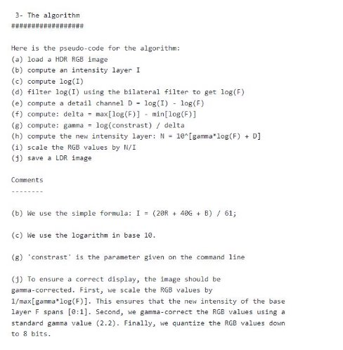

# **Digital Vision Project #1  High Dynamic Range Imaging** 

## **Program Usage**

cd code

python main.py 

main執行時會read data folder裡全部的image

並依序執行alignment hdr tonemapping

預設會使用data1

## **拍照設備** 

**Samsung Galaxy Note 20 Ultra** 

## **開發環境**

**Python 3.8.12** 

**Library** 

1. **Opencv** 
2. **Scipy** 
3. **Numpy** 
4. **Matplotlib** 

## **實作內容** 

1. **MTB alignment**   根據上課所說實作  MTB  ， 

第一步  :  轉灰階 

第一步  :  將圖片 pixel 值<=median =0,  反之=255,取得 mask 

第三步  :  圖片 resize 5 次後,依 9 種移動的組合位移 pixel 值,選擇誤差最大的

|(-1,1) |(0,1) |(1,1) |
| - | - | - |
|(-1,0) |(0,0) |(1,0) |
|(-1,-1) |(0,-1) |(1,-1) |

第四步  :  把圖片依序回推最佳的移動 pixel 值,最後在原圖上位移得到的最佳 pixel 值 將所有圖片對齊第一張圖片。  

2. **HDR** 實作課堂提到的  Paul Debevec's method， 

使用  python 的 scipy library 來填 sparse matrix 和解 least square solution 然後將得到的 g(x) function 經由下面式子得到 irradiance map 

3. **Tone mapping** 實作 Durand 的方法。 參考了 Durand 的 GitHub 上詳細的步驟

首先拿出得到圖片的 **intensity** 

接著在 **log domain** 上用 **bilateralFilter** 取得 **low\_pass** 的圖**(),**將 **log(intensity)-log(low\_pass)**取 得 **log(high\_pass)**的部分**,**把 **low\_pass** 的部分壓縮後**+**回 **high\_pass** 的部分並還原回一般的 **domain** 

再來將 HDR 的 RGB 值分別除以 intensity 再乘上上一步還原回一般 domain 的結果分別得到 LDR 的 RGB 

最後把結果轉型成 unsign int8 並輸出 

***INPUT*** 

Data1 

   

   

  

Data2 

  

  

  

***Result :* recovered HDR :** 

Data1 Response curve 

R :                     G :                   B : 

  

Data2 Response curve 

  

***tone mapping result :***  

Data1 

Data2 

